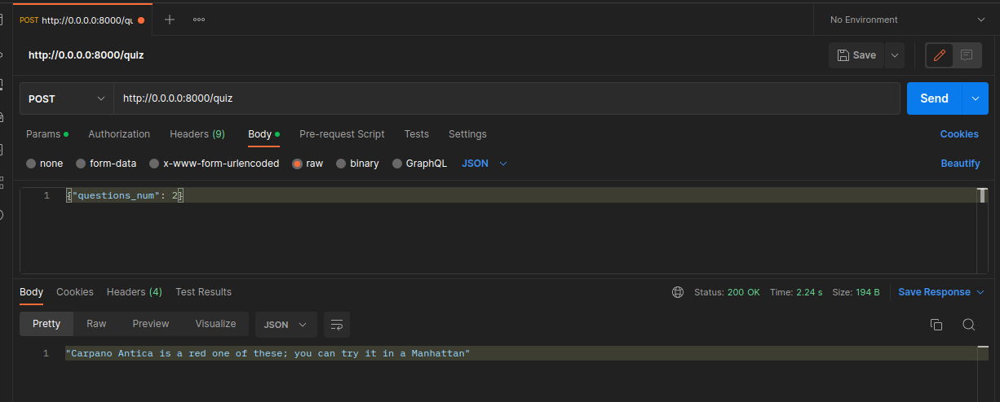

<h1>Инструкция по запуску</h1>

<ol>
<li>Клонируйте репозиторий: 
<code>git clone https://github.com/CHRNVpy/quizz.git</code></li>

<li>Перейдите в папку с клонированным репозиторием.</li>

<li>Создайте docker контейнер: 
<code>docker-compose up</code></li>

<li>Запустите docker image через Docker desktop или командой: 
<code>docker run -p 8000:8000 &lt;название image(образа)&gt;</code></li>

<strong>Пример запроса к POST API сервиса c помощью Postman</strong>
